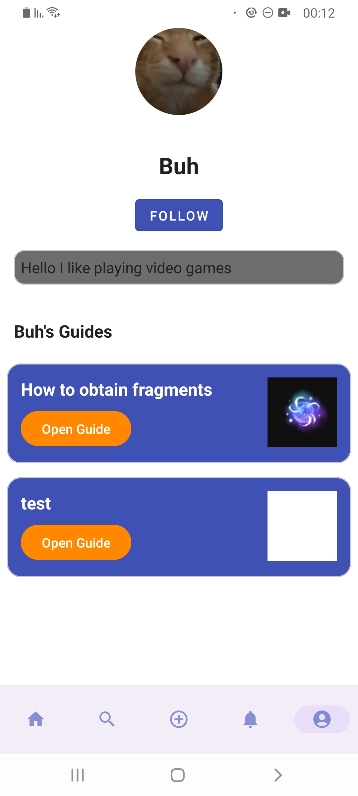

### GameGuru: Your Ultimate Game Guide Companion

GameGuru is a versatile and comprehensive game guide companion app that helps gamers access detailed guides, tips, and walkthroughs for a wide range of games. Whether you're seeking help to conquer tough levels or discover hidden secrets, GameGuru is designed to enhance your gaming experience with its extensive features.

### Features

1. **Game Guide Library**
   - **Extensive Guides**: Access a wide range of game guides covering various genres and platforms.
   - **Search Functionality**: Quickly find guides or games with easy search options.
   - **Rich Content**: Guides include detailed text, images, and links to provide a complete solution.

2. **User-Created Content**
   - **Create Guides**: Users can create and publish their own guides, adding to the community's wealth of knowledge.
   - **Dynamic Editor**: Utilize a rich-text editor to format guides with headings, lists, images, and links.
   - **Drafts & Publishing**: Save guides as drafts or publish them for others to see.

3. **User Management**
   - **Profile Customization**: Customize your profile with a username, avatar, and personal description.
   - **Following System**: Follow your favorite guide creators and get notified of their latest guides.
   - **Recent Activity**: Track your recently viewed guides for quick access.

4. **Game & Guide Integration**
   - **Game Pages**: Explore game-specific pages showcasing all related guides.
   - **Related Guides**: View guides linked to specific games, ensuring relevant content is always at your fingertips.

5. **Social Interaction**
   - **Follow/Unfollow**: Follow users to keep up with their content.
   - **Author Pages**: Visit author profiles to explore all their published guides.

6. **Firebase Integration**
   - **Firestore Database**: Real-time data syncing for guides, games, and user profiles.
   - **Firebase Authentication**: Secure user authentication for sign-in and registration.
   - **Firebase Storage**: Handles images and guide content storage securely.

### Usage

1. **Explore Game Guides**: Search for any game and access detailed guides created by the community.
2. **Create & Share**: Contribute by creating and sharing your own guides using the dynamic editor.
3. **Stay Updated**: Follow your favorite authors and stay updated on their latest guides.
4. **Manage Your Profile**: Customize your profile, track your guides, and follow other users.

Here is the updated README section with the correct demo video link:

---

## Screenshots

  
  
    

  

  
  
  
  

  
  
  
  

  
  

## Demo Video

  

### Contact

For any inquiries or feedback, please contact via [email](danielraby123@gmail.com)
